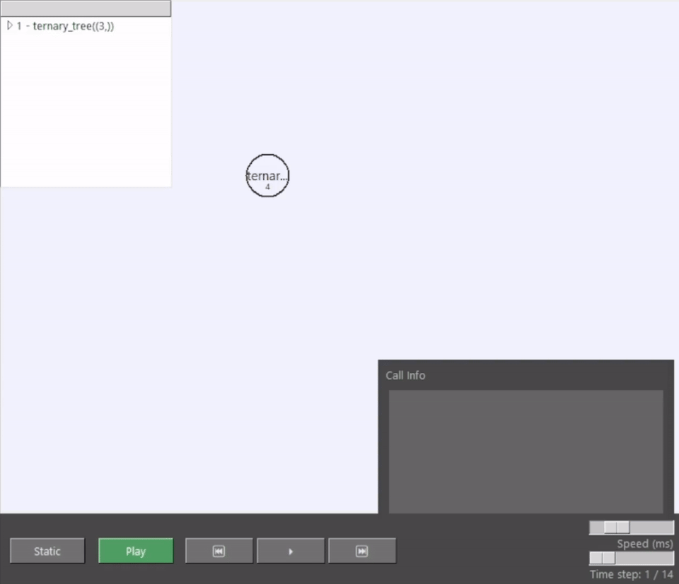

# StackSprout



**StackSprout** is a Python library for visualizing recursive function execution as interactive call trees with optional timeline-based animation.

It helps you *see* how recursion grows, branches, and unwinds — making it useful for learning, debugging, and exploration.

Unlike debuggers or profilers, StackSprout records execution first and visualizes it afterward, enabling deterministic playback and timeline control.

---

## Features

- Visualize recursive calls as a clean tree layout
- Static and animated execution modes
- Timeline scrubbing, stepping, and playback controls
- Interactive canvas with pan and zoom
- Clickable nodes with detailed call information
- Synchronized tree and hierarchy views
- Works with any recursive Python function

---

## Installation

```bash
pip install stacksprout
```

## Quick Example
```python
from stacksprout import trace, visualize_tree

@trace
def fib(n):
    if n <= 1:
        return 1
    return fib(n - 1) + fib(n - 2)

fib(6)
visualize_tree(fib)
```

This will open an interactive window displaying the recursive call tree for `fib(6)`.

---

## Design Overview

StackSprout operates in two phases:

1. **Tracing phase**
    - A decorator (`@trace`) records function entry and exit events during execution.
    - Each call is stored with its arguments, return value, and timing information.
2. **Visualization phase**
    - After execution, the recorded data is converted into a call tree.
    - The tree can be viewed statically or played back as an animation over time.

This design ensures deterministic, debuggable visualizations without interfering with runtime behavior.

---

## Usage Notes
- The decorated function **must** be executed before calling `visualize_tree()`.
- If no trace data exists, StackSprout displays a helpful message and exits cleanly.
- Mutual recursion and multi-root call trees are not supported in v1.

---

## Examples

Additional examples can be found in the `examples/` directory:
- Fibonacci
- Factorial
- Custom recursive functions

---

## Requirements

- Python 3.10 or newer
- `tkinter` (included with most Python installations; Linux users may need `python3-tk`)

---

## License

This project is licensed under the **MIT license**.

---

## About

Built as an educational and exploratory tool for understanding recursion and call stacks. Feedback is welcome.
